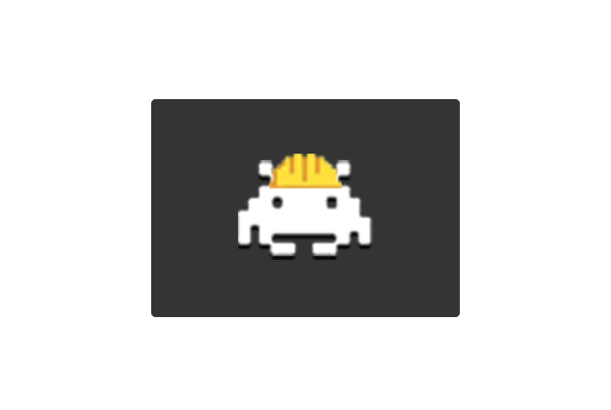

# Build A Dream   

  

> Status: **Concluído** ✔️

## Sumário 

- [Apresentação](#apresentação)
- [Objetivo](#objetivo)     
- [Funcionalidades](#funcionalidades)      
- [Tecnologias](#tecnologias)
- [Instalação](#instalação)
- [Referências](#referências)  
      
## **Apresentação**

O "Build a Dream" é um projeto da aluna Júlia de Melo tuma On12 de conclusão do curso de Back-end [{reprograma}](https://reprograma.com.br/) em parceria com a [Accenture](https://www.accenture.com/br-pt). O projeto consiste na construção de uma API que tem o objetivo de armazenar, consultar, atualizar ou deletar informações referentes a produtos tecnologicos.

## **Objetivo**
     
Com o aumento da presença da tecnologia nas nossas vidas o computador virou uma peça fundamental para todos, porém a falta de conhecimento sobre peças de computador faz com que muitos compradores percam dinheiro comprando componentes não compatíveis, sem potência para suas demandas ou até mesmo sendo enganados pelos vendedores. Visando esse problema o build a dream chega para mudar isso, API que fornece informações relevantes sobre cada peças e suas compatibilidades, e uma serie de metódos para que seja possível a montagem personalizada de um computador. A API auxilia os mercadores (donos de sites sobre venda de computador) a adicionar os componentes disponíveis e o cliente com a parte "computador" onde é armazenado todas as suas escolhas de peças e calculado o total (todas essas funções presentes na API).

## **Funcionalidades**

- [X] Cadastro de placa mãe, processador, memória, periférico (parte do fornecedor).
- [X] Montar/Cadastrar computador (parte do cliente).
- [X] Listar placa mãe, processador, memória, periférico (parte do fornecedor).
- [X] Listar peças compativeis com a placa mãe (parte do cliente).
- [X] Listar computador e o preço total (parte do cliente).
- [X] Calcular preço total de todas as peças escolhidas.
- [X] Atualização placa mãe, processador, memória, periférico (parte do fornecedor).
- [X] Edição de algum elemento na montagem do computador (parte do cliente).
- [X] Deleção placa mãe, processador, memória, periférico (parte do fornecedor).
- [X] Deleção montagem computador(parte do cliente).

## **Tecnologias**

## **Instalação**

- Faça um fork ou um clone do projeto pelo link (<https://github.com/juliathemelo/Build_dream_project>);
- Instale as dependências necessárias à executando o comando 'npm install';
- Crie um .env com o parâmetro `MONGODB_URL` e bote a sua conexão com o robo3T
- Para executar a API, execute 'npm start'

## **Referências**

## **Autora**

- Júlia de Melo Albuquerque

### Contato:
 

      
     

